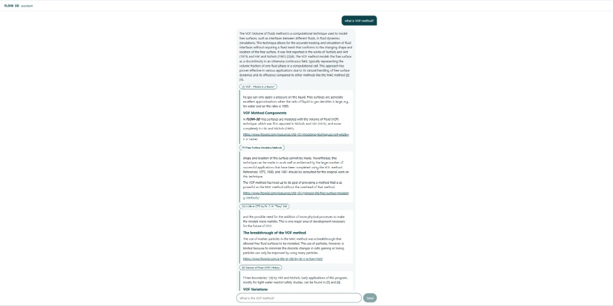

# FLOW-3D RAG assistant

A chat that answers questions about FLOW-3D and CFD using only public pages from flow3d.com. Every answer cites the passage it used.



## Agentic RAG

`rag/agent.py` lets the model choose a tool before it answers. It can grep `docs.jsonl` for an exact token such as `VOF`, or call semantic search. It searches at most twice, then answers from those passages.

## Semantic RAG

`rag/retrieve.py` embeds the question with `BAAI/bge-small-en-v1.5`, searches Chroma, and searches a BM25 keyword index. The two lists are merged by reciprocal rank fusion, then a cross-encoder reranks the short list. Keyword search keeps exact terms like `VOF` and `FAVOR` from being lost.

## Setup

Install [Ollama](https://ollama.com/), then pull the chat model:

```powershell
ollama pull qwen2.5:7b
```

Leave Ollama running. Python 3.12:

```powershell
python -m venv .venv
.\.venv\Scripts\Activate.ps1
pip install -r requirements.txt
```

Build the index from the repo root. The fetch step pauses between requests, so the first run takes a while.

```powershell
python scrape\discover.py
python scrape\fetch.py
python scrape\extract.py
python index\chunks.py
python index\embed.py
```

Start the API, then the chat page:

```powershell
.\.venv\Scripts\python.exe -m uvicorn rag.api:app --port 8000
```

```powershell
cd web
npm install
npm run dev
```

Open http://localhost:5173/.

If HTTPS downloads fail with a certificate error on Windows, `pip install pip-system-certs` and rerun the command.
